# NMSlite - Architecture Diagrams & Flows

> **Version:** 2.2.0  
> **Last Updated:** December 2024

---

## Architecture Decisions Summary

| Area | Decision |
|------|----------|
| **Databases** | PostgreSQL (state/CRUD) + TimescaleDB (metrics/time-series) |
| **Metrics Writer** | Separate goroutine consuming from MetricResults channel |
| **Credential Profiles** | Reusable authentication configs; created first, linked by discovery profiles |
| **Discovery Profiles** | Link to credential profiles + define IP range/subnet for scanning |
| **Credential Decryption** | On use by Poller (not at cache time) |
| **Metrics Fields** | Store `total` + `used` only; derive `%` at query time |
| **Cache Scope** | Credential profiles only (not monitors or devices) |
| **Error Handling** | Retry 2x with backoff, then update `last_error` fields |
| **Monitor State** | Two fields: `last_polled` (success) + `last_attempted` (any) |
| **Deletion Rules** | No cascades; must delete monitor before credential profile/device |
| **Discovery Profiles** | Devices remain independent after profile deletion |
| **Plugins** | Metric collectors assigned to monitors; extensible interface |
| **Metrics Retention** | Keep forever (no automatic cleanup) |
| **Alerting** | None (MVP scope) |
| **Authentication** | Stateless JWT; single admin user from env vars |

---

## 1. System Architecture


---

## 2. Database Architecture


---

## 3. Database Schema

### 3.1 PostgreSQL (State DB)


### 3.2 TimescaleDB (Metrics DB)


> **Note:** Percentage values (`memory_%`, `disk_%`, `net_%`) are derived at query time from `total` and `used` fields.

---

## 4. User Journey


---

## 5. Authentication Flow


> **Note:** Single admin user. Credentials from env vars. No users table. No refresh tokens. Fully stateless.

---

## 6. Discovery Flow


---

## 7. Provisioning Flow


---

## 8. Polling Flow (Background)


---

## 9. Metrics Query Flow


---

## 10. Channel Architecture


### Message Types


---

## 11. Component Responsibilities

| Component | Responsibility |
|-----------|----------------|
| **API** | HTTP handlers, JWT auth, validation, routes, CRUD operations |
| **Discovery Engine** | Scans subnets, identifies Windows hosts, saves to DB |
| **PostgreSQL** | State storage: profiles, devices, credentials, monitors |
| **TimescaleDB** | Time-series metrics storage with automatic partitioning |
| **Cache** | In-memory credential cache, invalidated on update events |
| **Scheduler** | Reads due monitors from DB, dispatches PollJobs via channel |
| **Poller** | Worker pool, consumes jobs, decrypts creds, runs plugins |
| **Plugins** | WMI/WinRM collectors (extensible interface) |
| **Writer** | Consumes MetricResults, batch inserts to TimescaleDB |

---

## 12. Deletion Rules & Dependencies


### Deletion Behavior

| Entity | Rule | On Violation |
|--------|------|--------------|
| **Monitor** | Can always delete | Cascade deletes associated metrics |
| **Credential Profile** | Cannot delete if referenced by any monitor or discovery profile | `400 Bad Request: Credential Profile in use by monitor(s) or discovery profile(s)` |
| **Device** | Cannot delete if referenced by any monitor | `400 Bad Request: Device in use by monitor(s)` |
| **Discovery Profile** | Can always delete | Devices remain (independent once discovered) |
| **Plugin** | Cannot delete if referenced by any monitor | `400 Bad Request: Plugin in use by monitor(s)` |

### Deletion Flow


---

## 13. Error Handling Strategy

```mermaid
flowchart TD
    A[Poller receives PollJob] --> B[Update last_attempted]
    B --> C[Attempt collection]
    C --> D{Success?}
    
    D -->|Yes| E[Send to MetricResults channel]
    E --> F[Writer batch inserts]
    F --> G[Update last_polled]
    
    D -->|No| H{Retry count < 3?}
    H -->|Yes| I[Backoff wait]
    I --> C
    H -->|No| J[Update last_error + last_error_at]
    J --> K[Log warning]
    K --> L[Skip this poll cycle]
```



---

## 14. API Endpoints Summary

```
Base: https://localhost:8443/api/v1
```

### Authentication (Stateless)
| Method | Endpoint | Description |
|--------|----------|-------------|
| POST | `/auth/login` | Get JWT token |

### Step 1: Credential Profiles (create first - reusable auth config)
| Method | Endpoint | Description |
|--------|----------|-------------|
| GET | `/credential-profiles` | List all (no password) |
| POST | `/credential-profiles` | Create credential profile |
| GET | `/credential-profiles/:id` | Get credential profile |
| PUT | `/credential-profiles/:id` | Update credential profile |
| DELETE | `/credential-profiles/:id` | Delete (if no monitors/discovery profiles) |

### Step 2: Discovery Profiles (links to credential profile + defines IP range)
| Method | Endpoint | Description |
|--------|----------|-------------|
| GET | `/discovery-profiles` | List all profiles |
| POST | `/discovery-profiles` | Create profile (requires credential_profile_id) |
| GET | `/discovery-profiles/:id` | Get profile |
| PUT | `/discovery-profiles/:id` | Update profile |
| DELETE | `/discovery-profiles/:id` | Delete profile (devices remain) |
| POST | `/discovery-profiles/:id/run` | Run discovery |

### Step 3: Devices (created by discovery run)
| Method | Endpoint | Description |
|--------|----------|-------------|
| GET | `/devices` | List all devices |
| GET | `/devices/:id` | Get device |
| DELETE | `/devices/:id` | Delete device (if no monitors) |

### Step 4: Monitors (provision discovered devices)
| Method | Endpoint | Description |
|--------|----------|-------------|
| GET | `/monitors` | List all monitors |
| POST | `/monitors` | Create monitor (provision) - requires device_id, credential_profile_id, plugin_id |
| GET | `/monitors/:id` | Get monitor |
| PUT | `/monitors/:id` | Update monitor |
| DELETE | `/monitors/:id` | Delete monitor + its metrics |
| GET | `/monitors/:id/metrics` | Get latest metrics |
| GET | `/monitors/:id/metrics/history` | Get historical metrics |

### Step 5: Plugins (metric collectors assigned to monitors)
| Method | Endpoint | Description |
|--------|----------|-------------|
| GET | `/plugins` | List all plugins |
| POST | `/plugins` | Create plugin |
| GET | `/plugins/:id` | Get plugin |
| PUT | `/plugins/:id` | Update plugin |
| DELETE | `/plugins/:id` | Delete plugin (if no monitors) |

### Health
| Method | Endpoint | Description |
|--------|----------|-------------|
| GET | `/health` | Health check (no auth) |
